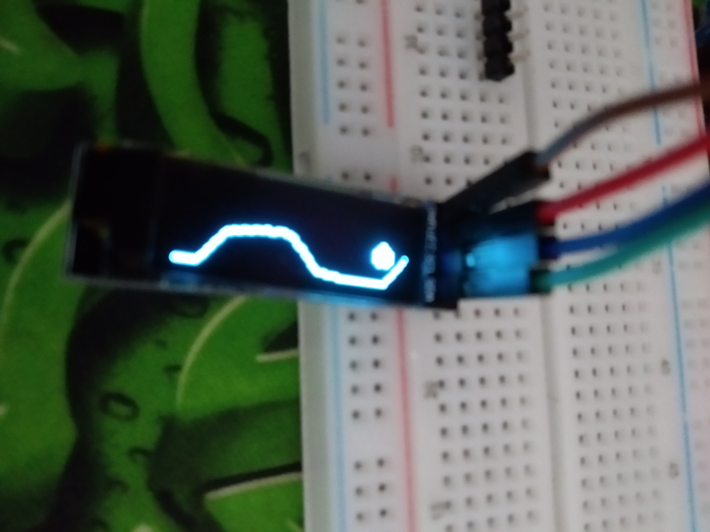

# OscilloscopeSSD1306 
A bad oslliscope using the Arduino Uno's 5 DAC channels and an SSD1306 display. I don't have a good osilliscope to check if it's even working fully correctly.

## Features
- Max voltage on display is displayed
- Partial Waveform

## Requirements
- Adafruit GFX library.
- Adafruit SSD1306 library.
- Arduino device (I only tested it on Uno but it should work on others too.)
- <a href="#requirements">Wiring</a> (need atleast 5)

## Wiring
- Arduino GND -> Display GND
- Arduino 3v3 -> Display VCC
- Arduino SCL -> Display SCL
- Arduino SDA -> Display SDA
- Arduino A0 -> Input of what you wanna measure.

## Credits
- The Adafruit team.
- This [video](https://www.youtube.com/watch?v=7x1P80X1V3E&feature=youtu.be) for making me want to play with my electronics again.